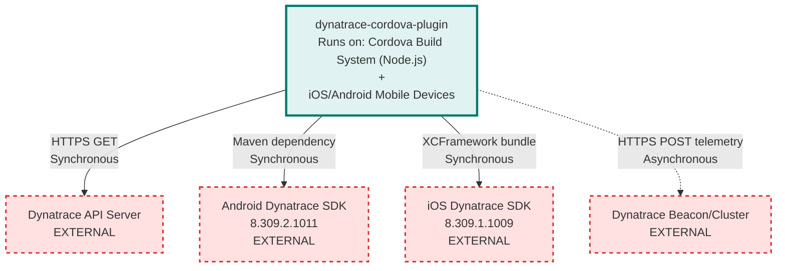

# Dynatrace Cordova Plugin Architecture

> **Repository:** dynatrace-cordova-plugin
> **Runtime Environment:** Build-time instrumentation plugin + Runtime monitoring library
> **Last Updated:** 2026-03-20

## Overview

This is a Cordova plugin that integrates Dynatrace monitoring into hybrid mobile applications. It operates in two phases: at build time, it instruments the application by injecting monitoring agents; at runtime, the injected agents send telemetry data to Dynatrace servers.

## Architecture Diagram

## External Integrations

| External Service | Communication Type | Purpose |
|------------------|-------------------|---------|
| Dynatrace API Server | Sync (HTTPS GET) | Download JavaScript monitoring agent during build |
| Dynatrace Beacon/Cluster | Async (HTTPS POST) | Send telemetry data from instrumented apps at runtime |
| Android Dynatrace SDK | Sync (Maven) | Native monitoring library for Android (8.309.2.1011) |
| iOS Dynatrace SDK | Sync (XCFramework) | Native monitoring library for iOS (8.309.1.1009) |

## Architectural Tenets

### T1. Build-Time vs Runtime Separation

The plugin operates in two distinct phases with different execution contexts. Build-time instrumentation runs as Cordova hooks during application compilation, while runtime monitoring executes within the compiled mobile application. This separation ensures monitoring logic is injected before deployment without requiring application code changes.

**Evidence:**
- `plugin.xml` - Declares Cordova hooks (`after_prepare`, `before_plugin_install`, `before_prepare`) that execute during build
- `scripts/Instrument.js` (in `instrument` function) - Orchestrates build-time HTML injection and native SDK configuration
- `other/DynatraceCordovaPlugin.java` (in `execute` method) - Handles runtime API calls from instrumented JavaScript
- `other/DynatraceCordovaPlugin.m` (in `endVisit`, `identifyUser`) - Provides runtime bridge to native iOS monitoring

### T2. Platform-Specific Native Bridge Pattern

Each mobile platform (Android, iOS) requires a separate native implementation to bridge JavaScript API calls to platform-specific Dynatrace SDKs. The plugin must maintain parallel implementations that expose identical JavaScript interfaces while delegating to different native APIs.

**Evidence:**
- `other/DynatraceCordovaPlugin.java` - Android bridge using `cordova.exec` to call native Dynatrace Android SDK
- `other/DynatraceCordovaPlugin.m` and `other/DynatraceCordovaPlugin.h` - iOS bridge using Objective-C to call Dynatrace iOS XCFramework
- `other/DynatraceCordovaPlugin.js` (in module.exports) - Unified JavaScript API that abstracts platform differences
- `plugin.xml` - Platform-specific `<platform>` sections configure native dependencies separately for Android and iOS

### T3. Declarative Configuration Over Programmatic Setup

Application developers configure monitoring through a declarative configuration file (`dynatrace.config.js`) rather than programmatic API calls. Build scripts read this configuration to inject appropriate monitoring code and native SDK settings, keeping monitoring setup separate from application logic.

**Evidence:**
- `files/default.config.js` - Template showing declarative structure for Android/iOS beacon URLs and application IDs
- `scripts/config/ConfigurationReader.js` (in `readConfiguration`) - Reads and parses configuration file at build time
- `scripts/Android.js` (in `writeGradleConfig`) - Generates Android Gradle configuration from declarative config
- `scripts/Ios.js` (in `modifyPListFile`) - Generates iOS plist entries from declarative config

### T4. HTML Instrumentation Through Static Injection

JavaScript monitoring is achieved by statically injecting the Dynatrace JavaScript agent into HTML files during the build process rather than loading it dynamically at runtime. This ensures monitoring starts before application code executes and works in offline scenarios.

**Evidence:**
- `scripts/helpers/InstrumentHelper.js` (in `instrument` function) - Downloads JS agent and orchestrates HTML injection
- `scripts/html/HtmlInstrumentation.js` - Implements HTML parsing and script tag injection into application HTML files
- `scripts/DownloadAgent.js` (in `downloadAgent`) - Fetches JavaScript agent from Dynatrace API server during build
- `networking/NativeNetworkInterceptorUtils.js` - Provides runtime utilities to link native requests with injected JavaScript agent

### T5. OutSystems-Specific Customization Layer

The plugin contains a dedicated OutSystems integration layer that extends the standard Cordova plugin behavior. This layer handles platform-specific pre-build setup and configuration file management without modifying the core instrumentation logic.

**Evidence:**
- `scripts/Outsystems/` - Separate directory containing OutSystems-specific hooks
- `scripts/Outsystems/npmInstall.js` - Handles npm dependency installation for older Cordova versions in OutSystems MABS
- `scripts/Outsystems/copyConfig.js` - Copies Dynatrace configuration from `www/dynatraceConfig` to project root before build
- `plugin.xml` (hooks) - Registers OutSystems hooks (`before_plugin_install`, `before_prepare`) alongside standard Cordova hooks
- `other/IdentifyUserNative.js` - Custom native user identification API added for OutSystems use case
